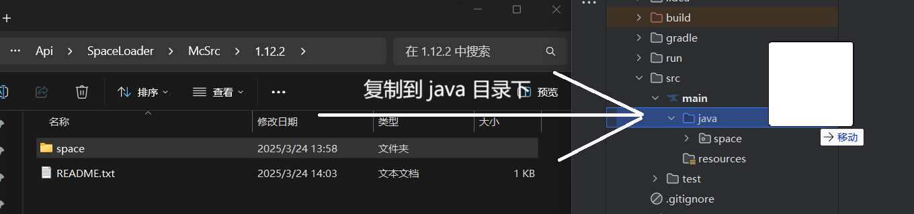
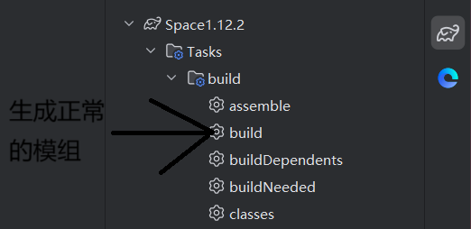
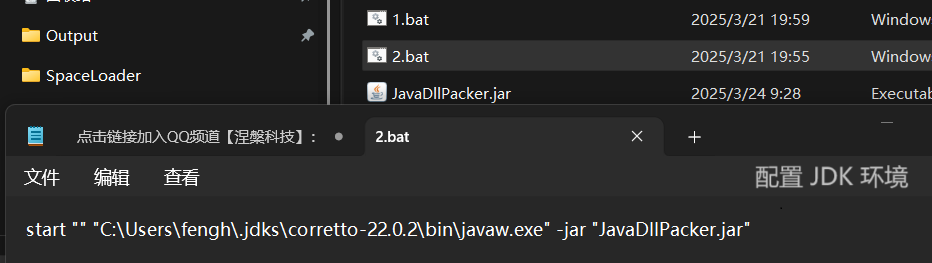
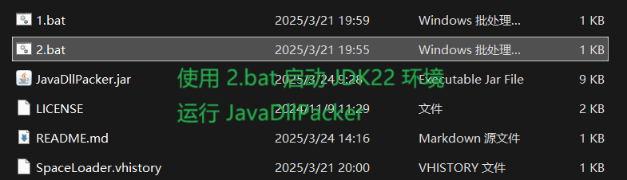
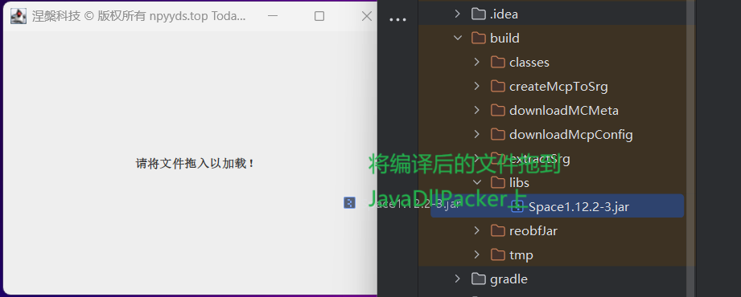
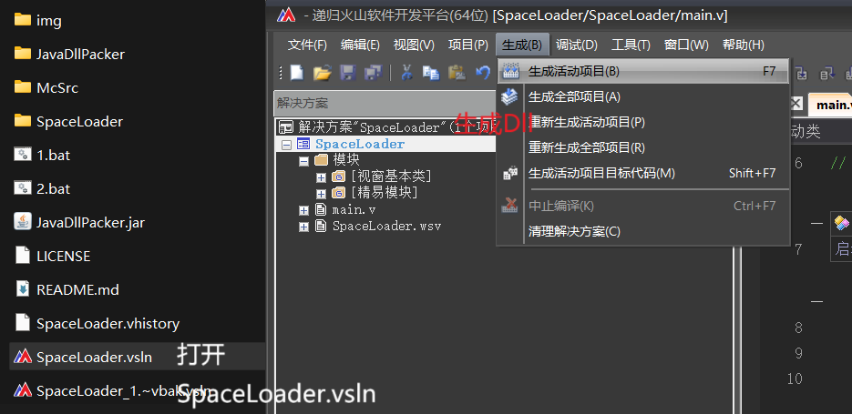
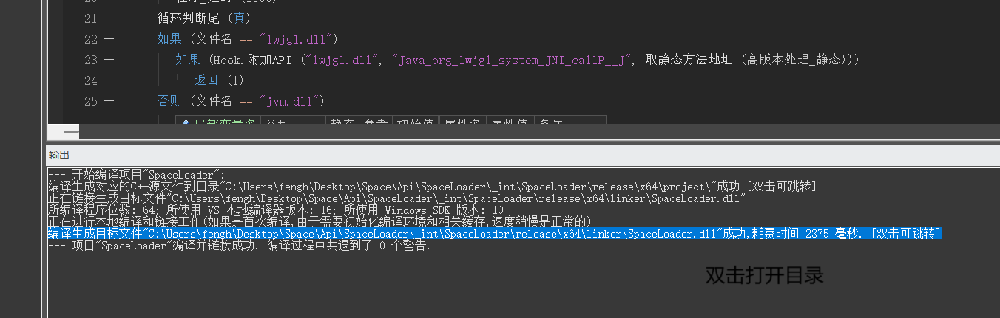

# SpaceLoader

### 介绍
我的世界将模组转换为DLL的技术, 它还有个名字叫 "Loader" 
注意 ! 它只能加载 ".class" , 并不能不能将 "resources" 中的文件加载，因此无法使用"mixin" 
A minecraft forge mod injector 

### 源码介绍
Loader [核心] 
基于火山软件开发平台(64位)开发。

JavaDllPacker 
基于Idea2024 JDK22开发。

### 开源声明
您对项目进行 "许可和版权声明" 后可以进行任何操作，包括但不限于 "商用，修改，分配，私人使用"。 
所有您无需担心 会出现反对声音，项目使用 "MIT License" ! 更多许可请前往 "LICENSE" 查看。

### 开源来源
https://npyyds.top/ 
https://gitee.com/newNP/SpaceLoader/ 
https://github.com/NirvanaTec/SpaceLoader/ 

### 使用说明

#### 复制代码
1. 
#### 编译模组
2. 
#### 配置 JavaDllPacker 环境
3. 
#### 启动 JavaDllPacker
4. 
#### 使用 JavaDllPacker
5. 
#### 生成动态链接库
6. 
#### 显示生成文件
7. 

