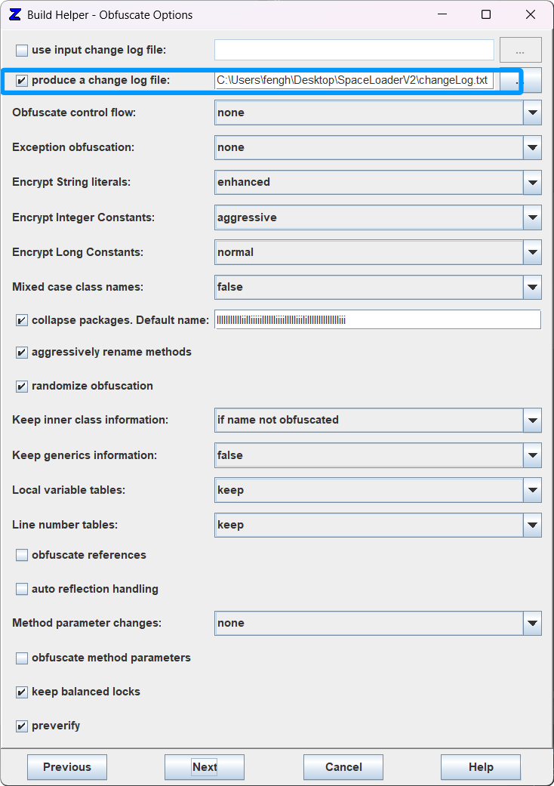

# SpaceLoader V2

### 介绍
我的世界将模组转换为DLL的技术, 它还有个名字叫 "Loader" 
注意 ! 它只能加载 ".class" 文件, 它并不能将 "resources" 中的文件加载，因此无法使用常规的 "mixin"。 A minecraft forge mod injector

### 核心技术
1.支持 mod 使用 zkm/obfuscator 等混淆器。
2.支持 VMP 等 软件保护技术。
3.支持 内置多重加密，把一个 "类" 使用密码加密，密码随机，获取密码的方法也会被加密。

### 源码介绍
Loader [核心] 基于火山软件开发平台(64位)开发。

JavaDllPacker 基于Idea2024 JDK22开发。

### 开源声明
您对项目进行 "许可和版权声明" 后可以进行任何操作，包括但不限于 "商用，修改，分配，私人使用"。 所有您无需担心 会出现反对声音，项目使用 "MIT License" ! 更多许可请前往 "LICENSE" 查看。

### 开源来源
https://npyyds.top/
https://gitee.com/newNP/SpaceLoader/
https://github.com/NirvanaTec/SpaceLoader/

### 使用说明
#### 复制代码
1. 
#### 编译模组
2. 

#### zkm 混淆【可选】
1. 添加 混淆名 排除
    
2. 调整配置
    
    changeLog.txt，生成到与 JavaDllPacker.jar 相同位置的路径

#### 是否使用多重加密? 
1. 是
    运行 SpaceLoaderExcute.exe
2. 否
    配置 JavaDllPacker 环境! 

#### 启动 JavaDllPacker
4. 

#### 使用 JavaDllPacker
5. 

#### 生成动态链接库
6. 

#### 显示生成文件
7. 

